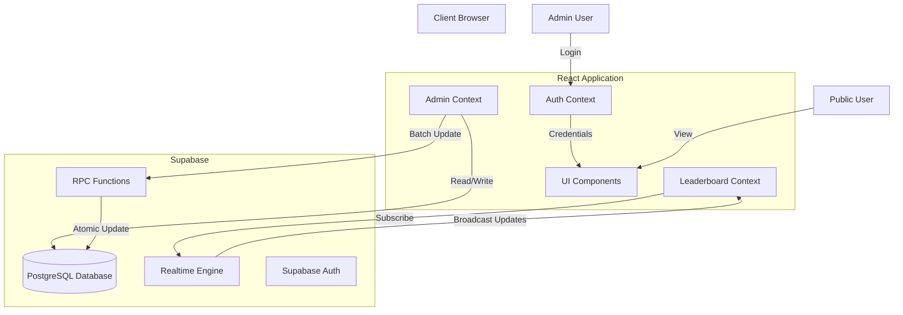

# 🏆 Leaderboard Application


A modern, real-time leaderboard application built with React and Supabase. It features live score updates, an admin panel for bulk data management, and a dynamic, responsive UI.

---

## 🏗 Architecture

The application follows a client-server architecture using Supabase as the backend-as-a-service (BaaS) for database and real-time capabilities.



---

## ✨ Features

- **Real-time Leaderboard**: Scores update instantly across all connected clients.
- **Admin Panel**:
  - Secure login access.
  - Bulk upload teams & scores via Excel/CSV.
  - Manual score adjustments.
  - Visibility controls for specific metrics.
- **Responsive Design**: Optimized for desktops, tablets, and mobile devices.
- **Animations**: Smooth transitions using Framer Motion.

---

## 🚀 Setup Guide

Follow these steps to set up the project locally.

### 1. Prerequisites

- [Node.js](https://nodejs.org/) (v16 or higher)
- [Supabase](https://supabase.com/) Account

### 2. Installation

Clone the repository and install dependencies:

```bash
git clone <repository-url>
cd leader-board
npm install
```

### 3. Environment Configuration

Create a `.env` file in the root directory:

```env
VITE_SUPABASE_URL=https://cmlwammerxpeveprnrux.supabase.co
VITE_SUPABASE_ANON_KEY=sb_publishable_QaxJjw17LOvv254GTn-7GQ_0_0EUp5t
```

### 4. Database Setup

You must set up the database schema and permissions in your Supabase project.

1.  Go to the [Supabase SQL Editor](https://supabase.com/dashboard/project/_/sql).
2.  **Create Tables**: Run the content of `database/setup.sql`.
3.  **Fix Permissions**: Run the content of `database/fix_permissions.sql`.

| Script                         | Purpose                                                                             |
| :----------------------------- | :---------------------------------------------------------------------------------- |
| `database/setup.sql`           | Creates `teams`, `leaderboard_settings` tables, and RPC functions.                  |
| `database/fix_permissions.sql` | Grants read/write access to the `anon` role (required for this app's architecture). |

---

## 📖 Usage

### Running Locally

Start the development server:

```bash
npm run dev
```

Visit `http://localhost:5173` in your browser.

### Admin Access

- **URL**: `/login` (or click the lock icon)
- **Username**: `admin`
- **Password**: `LinPack@2026`

### Bulk Upload

To upload scores in bulk, prepare an Excel (`.xlsx`) file with the following columns:

| Column Name | Description                    | Required?         |
| :---------- | :----------------------------- | :---------------- |
| `Team Name` | Unique identifier for the team | ✅ Yes            |
| `Ice Cream` | Score for Ice Cream challenge  | ❌ No (Default 0) |
| `Dart`      | Score for Dart challenge       | ❌ No (Default 0) |
| `Balloon`   | Score for Balloon challenge    | ❌ No (Default 0) |
| `Cup Stack` | Score for Cup Stack challenge  | ❌ No (Default 0) |

---

## 📂 Project Structure

```
├── public/              # Static assets
├── src/
│   ├── components/      # Reusable UI components
│   ├── context/         # React Context (State Management)
│   ├── features/        # Feature-specific components (Admin, Leaderboard)
│   ├── services/        # Supabase client configuration
│   ├── styles/          # Global styles & Tailwind config
│   ├── utils/           # Helper functions
│   ├── App.jsx          # Main application component
│   └── main.jsx         # Entry point
├── database/            # SQL setup scripts
└── package.json         # Project dependencies
```

---

## 🛠 Troubleshooting

**Issue**: "Could not find the table 'public.teams'..."
**Solution**: Run the `database/setup.sql` script in Supabase.

**Issue**: Realtime updates not working.
**Solution**: Ensure `supabase_realtime` publication is enabled on the `teams` table (handled by `setup.sql`).

**Issue**: Upload fails with permission error.
**Solution**: Run `database/fix_permissions.sql` to grant access to the `anon` role.

---

Built with ❤️ by the Linpack Team.
